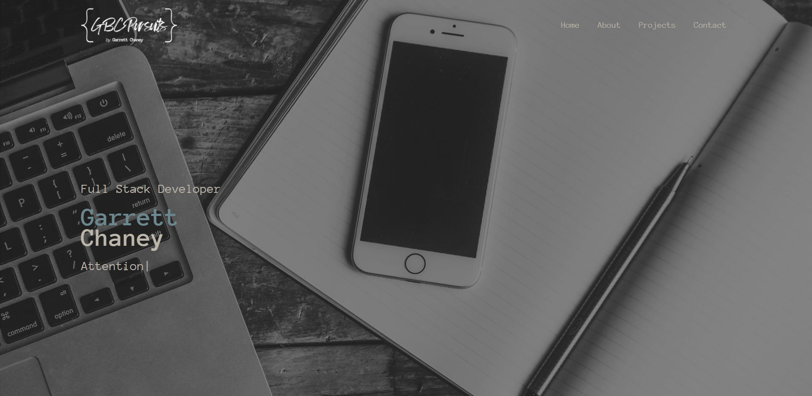

# Portfolio Page - Garrett Chaney

## Description

This webpage is intended to introduce myself, showcase my work, and provide potential collaborators and/or employers an easy way to contact me. 
    - The ABOUT section offers insight into who I am, what my goals are, and what skills I possess.
    - The PROJECTS section showcases a few of the projects I've completed myself, as well as some mock cards made up for demonstration purposes.
    - The CONTACT section gives visitors an easy way to offer feedback or get in touch with me.

## Installation

This application is currently running at: www.garrettchaney.com

## Usage

When loading the webpage you will be able to navigate effortlessly through the application sections. The webpage boasts modest interactivity and basic responsiveness.

## License
See attached license.

## Mockup Image

